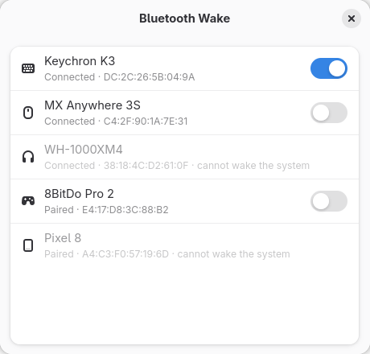

# Bluetooth Wake

A minimal GTK app to choose which Bluetooth devices can wake your computer
from suspend.

A bumped Bluetooth mouse or a controller turning on can wake a suspended
laptop. BlueZ lets you control this per device (`bluetoothctl wake <MAC> off`),
but no desktop Bluetooth settings panel exposes it. This app does.



## Features

- Lists paired and connected devices, connected first
- Per-device wake toggle (only input devices — mice, keyboards, controllers — support it)
- Warns when Bluetooth is off
- Warns when the USB controller hosting the Bluetooth adapter cannot wake the
  system, in which case the toggles have no effect
- Updates live as devices change

## Install

### Flatpak (local build)

```sh
flatpak-builder --user --install --force-clean build-dir io.github.julien_f.BtWake.yml
flatpak run io.github.julien_f.BtWake
```

### From source

Requires Python 3, PyGObject, GTK 4 and libadwaita ≥ 1.4, and BlueZ.

```sh
./bt-wake
```

No root access is needed: BlueZ lets the logged-in user change this setting.

## When the toggle doesn't help

Some adapter firmware (MediaTek chips in particular) ignores the per-device
setting while the system is suspended. You can instead disable wakeup for the
whole USB controller hosting the adapter. This stops *every* device on that
controller from waking the system.

Find the controller (the `pci` entry above `hci0`):

```sh
p=$(realpath /sys/class/bluetooth/hci0); while [ "$p" != /sys/devices ]; do
  [ "$(basename "$(realpath "$p/subsystem")")" = pci ] && { echo "$p"; cat "$p/vendor" "$p/device"; break; }
  p=$(dirname "$p"); done
```

Then add a udev rule with its vendor and device IDs, e.g.
`/etc/udev/rules.d/90-no-bt-wakeup.rules`:

```
ACTION=="add", SUBSYSTEM=="pci", ATTR{vendor}=="0x1022", ATTR{device}=="0x1118", ATTR{power/wakeup}="disabled"
```

The app shows a banner once this is in effect.

## License

GPL-3.0-or-later
